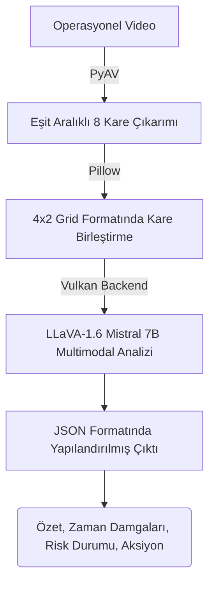

# [Proje Adı Eklenecek] - Video Analiz ve Karar Destek Ajanı

_TEKNOFEST 2026 Türkçe Yapay Zeka Dil Ajanları Yarışması - 3. Senaryo Çözümü_

**Takım Adı:** Dalga AI
**Takım Üyeleri:**

- **Bera Eren Tutkun** - Takım Kaptanı
- **Talha Hacıislamoğlu** - Junior AI Specialist
- **Hüseyin Taşkan** - LLM Agent Developer
- **Atagün Körükmez** - AI Developer
  **Proje Mottosu:** [Kısa Motto Eklenecek]

---

## 1. Proje Özeti ve Amacı (Senaryo 3)

Bu proje, TEKNOFEST 2026 Türkçe Yapay Zeka Dil Ajanları Yarışması'nın **3. Senaryosu: Video Analiz ve Karar Destek** kapsamında geliştirilmiştir.

Projenin temel amacı, operasyon sahası veya güvenlik kameralarından elde edilen yüksek hacimli video verilerini otonom olarak analiz edebilen, olayları zaman damgalarıyla (timestamp) yakalayan, videonun anlamsal özetini çıkaran, tespit edilen riskleri değerlendiren ve operatörlere anında eyleme dönüştürülebilir aksiyon önerileri sunan **tamamen yerel ortamda çalışan** bir yapay zeka ajanı geliştirmektir.

---

## 2. Sistem Mimarisi ve Kullanılan Teknolojiler

Geliştirilen sistem, video işleme ve multimodal modeli yerel donanımda birleştirerek dış servis bağımlılığı olmadan JSON formatında yapılandırılmış çıktılar üreten, uçtan uca otonom bir akışa sahiptir.

### Mimari Akış

Aşağıda projemizin uçtan uca veri işleme akışı görselleştirilmiştir:



1. **Video Girdisi İşleme:** Operasyonel video sisteme beslenir. PyAV kütüphanesi ile videonun tümünden eşit zaman aralıklı 8 adet temsil edici kare çıkarılır.
2. **Kare Birleştirme:** Çıkarılan kareler, mekansal ve zamansal dizilimi ifade etmek amacıyla (Pillow kullanılarak) 4x2 grid (ızgara) formatında tek bir görüntüye dönüştürülür.
3. **Multimodal Analiz (Vision-Language Model):** Elde edilen görsel grid, geliştirilmiş **LLaVA-1.6 Mistral 7B** modeline Vulkan backend üzerinden iletilir.
4. **Yapılandırılmış Çıktı Üretimi:** Sistem, elde ettiği bulguları (özet, zaman damgalı olaylar, risk durumu, aksiyon önerileri) formatı bozulmayacak şekilde bir JSON objesi olarak döner.

### Kullanılan Modeller

- **Birincil Model:** `LLaVA-1.6 Mistral 7B` (GGUF Q8_0 quantize edilmiş format)
- **Vision Encoder:** `mmproj-model-f16.gguf`
- **Alternatif Denenen Model:** `TimeLens-7B` (Qwen2.5-VL tabanlı)

### Kullanılan Framework ve Altyapılar


- **VLM Inference:** `llama-cpp-python`
- **GPU Backend:** `Vulkan` (AMD RX 9070 ve NVIDIA RTX 4060 GPU'larının aynı anda kullanılabilmesini sağlar)
- **Video ve Görsel İşleme:** `av` (PyAV), `Pillow`, `numpy`

---

## 3. Kurulum ve Çalıştırma Adımları (Zorunlu İsterler)

Proje tamamen dışa kapalı (offline) olarak çalıştırılmak üzere tasarlanmıştır.

### 3.1. Sistem Gereksinimleri

- İşletim Sistemi: Linux (veya WSL2 / Windows)
- Python Sürümü: Python 3.14 (Önerilen)
- GPU: Vulkan destekli en az 16GB VRAM tavsiye edilir. (Demo: AMD RX 9070 16GB + NVIDIA RTX 4060 8GB Çoklu GPU ortamında çalışmaktadır.)

### 3.2. Bağımlılıkların Kurulumu

Projenizi indirdikten sonra terminal üzerinden şu komutları sırasıyla çalıştırarak ortamı kurabilirsiniz:

```bash
# Repo klonlama
git clone https://github.com/[kullanici_adi]/[repo_adi].git
cd [repo_adi]

# Sanal ortam oluşturma ve aktifleştirme (Linux/Mac)
python3 -m venv venv
source venv/bin/activate

# (Opsiyonel: Eğer llama-cpp-python'ı Vulkan desteğiyle kurmak isterseniz:)
CMAKE_ARGS="-DGGML_VULKAN=on" FORCE_CMAKE=1 pip install llama-cpp-python --no-cache-dir

# Bağımlılıkları yükleme
pip install -r requirements.txt
```

### 3.3. Veri Seti

Projeyi test etmek için kullandığımız video örneklerini aşağıdaki açık kaynaklı bağlantıdan indirebilir, repo içerisindeki veri yoluna yerleştirebilirsiniz:

- **Veri Seti İndirme Linki:** [Google Drive/Kaggle Bağlantısı Eklenecek]

### 3.4. Projeyi Çalıştırma

Tüm kurulumlar tamamlandıktan sonra ana akışı başlatmak için aşağıdaki betik dosyasını çalıştırabilirsiniz:

```bash
# Doğrudan bash betiği ile tüm bağımlılık kontrolü ve çalıştırma
bash run.sh
```

Veya manuel olarak Python üzerinden:

```bash
python senaryo_3_demo.py
```

---

## 4. Senaryo Uygulaması ve Çıktılar

Geliştirilen sistem, şartnamedeki "Operasyon sahasında çekilmiş video girdi olarak yüklenir" senaryosunu başarılı bir şekilde işletir. Ajanımız (LLaVA tabanlı) görseldeki zaman algısını kullanarak tespitlerini aşağıdaki "Mock Fonksiyon" veya "Agent Framework" araçları ile JSON formatında sunar:

- **Multimodal Analiz ve Olay Tespiti:** Videonun başı, ortası ve sonunda gerçekleşen anomali veya olaylar (Örn: Forklift devrilmesi, personel toplanması) tespit edilir ve zamansal olarak sıralanır.
- **Risk Değerlendirmesi ve Özetleme:** Sistem, tespit edilen olayları harmanlayıp Türkçe bir özet sunar. Olayın vahametine göre risk seviyesini (Düşük, Orta, Yüksek vb.) belirler.
- **Aksiyon Önerileri:** Tespit edilen "Yüksek riskli" kazada sistem, "Sağlık ekibini çağır", "Alanı güvenlik altına al" gibi karar destek mekanizmalarını devreye sokar.

### Örnek Çalışma Çıktısı (JSON)

```json
{
  "summary": "Videoda forklift kazası ve yaralanma riski gözlenmiştir.",
  "events": [
    { "time": "00:15", "event": "Forklift devrildi" },
    { "time": "00:20", "event": "Yerde hareketsiz kişi" },
    { "time": "00:35", "event": "Personel toplanması" }
  ],
  "risk": "Yüksek",
  "actions": [
    "Sağlık ekibi talep et",
    "Alanı güvenlik altına al",
    "Güvenlik kameralarını kaydet"
  ]
}
```

---

## 5. Ölçümleme Sonuçları ve Performans Metrikleri (KPI'lar)

Sistemin başarısını ölçmek amacıyla bazı performans metrikleri (KPI) belirlenmiştir:

| Metrik                     | Değer       | Açıklama                                                                                   |
| -------------------------- | ----------- | ------------------------------------------------------------------------------------------ |
| **Video İşleme Süresi**    | < 1 sn      | 8 karenin çıkartılması ve 4x2 gridin oluşturulması süresi.                                 |
| **Model Inference Süresi** | Optimize    | Çift GPU (AMD + NVIDIA) optimizasyonu ile Vulkan backend üzerinden yerel ortamda sağlanır. |
| **VRAM Tüketimi**          | ~7.5 - 8 GB | GGUF (Q8_0) formatındaki 7B modelin VRAM tüketimi, çoklu GPU yük dağıtımı ile.             |
| **JSON Format Uyumluluğu** | > %90       | Model prompt mühendisliği ile parse edilebilir hatasız JSON çıktısı oranı.                 |

---

## 6. Karşılaşılan Zorluklar ve Çözüm Yaklaşımları

- **Çoklu / Farklı Marka GPU Kullanımı:** Sistemde AMD ve NVIDIA olmak üzere farklı mimarilerde GPU'lar bulunması standart PyTorch ortamlarında zorluk yarattığından, **Vulkan Backend** tabanlı `llama-cpp-python` kullanılarak heterojen donanım uyumluluğu sağlanmıştır.
- **Modelin Video Zaman Algısı:** Görüntü modellerinin zaman algısındaki (zaman damgası çıkarma) zayıflığını aşmak için videolar **grid formasyonuna (4x2)** dönüştürülüp sistem promptu ile "soldan sağa, yukarıdan aşağıya" zaman akışı olarak öğretilmiştir.
- **JSON Yanılsamaları (Hallucination):** Modelin zaman zaman JSON dışı düz metinler üretmesini engellemek için özelleştirilmiş `system_prompt` yapılandırılması yapılmış ve katı kurallar getirilmiştir.

---

## 7. Ölçeklenebilirlik İhtiyaçları ve Gelecek Geliştirmeler

- Çoklu video stream'leri (RTSP kameraları vb.) üzerinden anlık işleme yapabilmek için **vLLM** tabanlı model servisleme altyapısına geçiş çalışmaları.
- Modelleri spesifik iş güvenliği veya savunma sanayi senaryolarına yönelik ince ayar (fine-tuning) işleminden geçirmek.
- Agentic yapının daha otonom çalışarak diğer acil durum (API/Webhook) sistemlerini kendisinin tetiklemesi.

---

## 8. Materyaller: Demo Videosu ve Sunum

- **Proje Demo Videosu:** [Video YouTube/Drive Linki Eklenecek]
- **Sunum Dosyası (PDF/PPTX):** [Sunum Linki Eklenecek]

---

## 9. İletişim ve Lisans

Bu proje, açık kaynak kültürünü ve teknolojide bağımsızlığı desteklemek amacıyla geliştirilmiştir. Tüm kaynak kodlar izlenebilir, yeniden üretilebilir şekildedir.

**Etiketler:** `#BilisimVadisi2026`, `#TürkiyeAçıkKaynakPlatformu`
